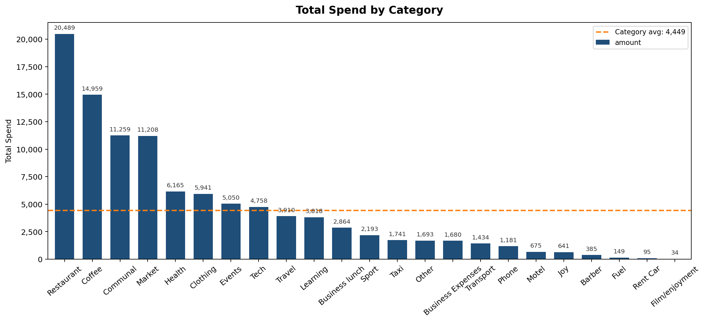
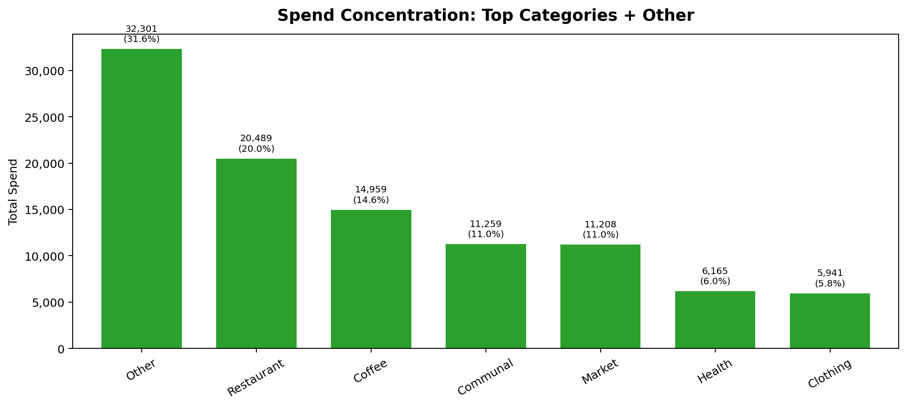
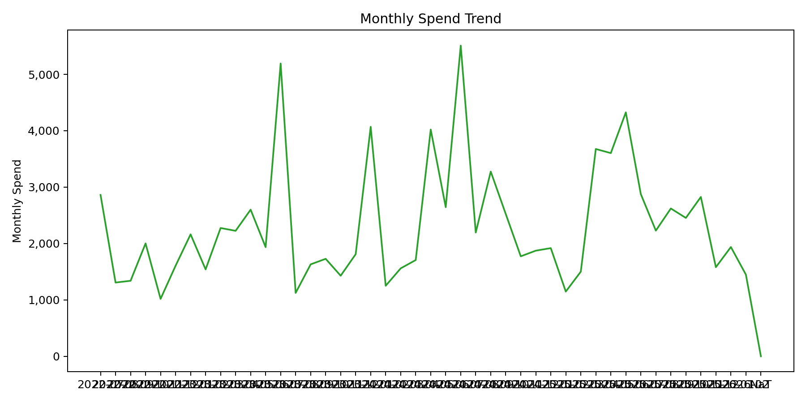
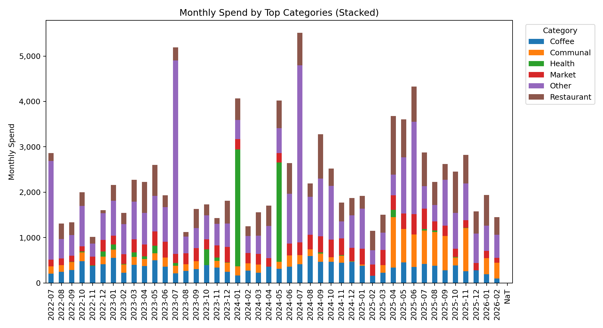
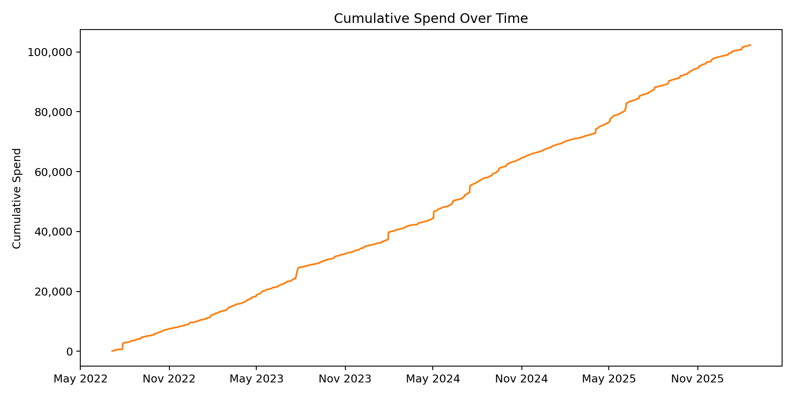
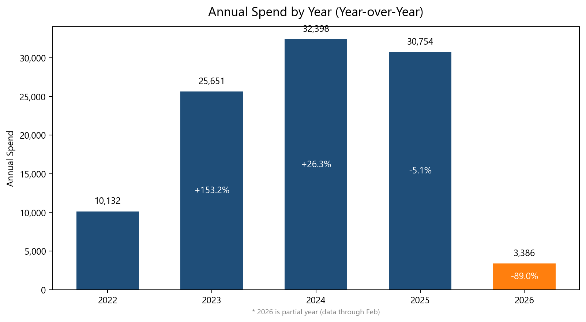
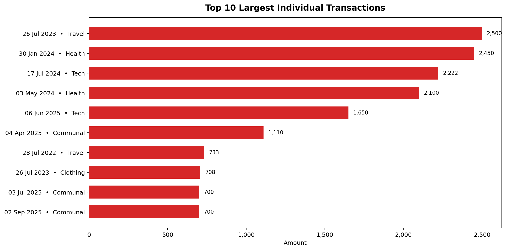

**Spending Snapshot (Jul 2022–Feb 2026)**
This is a presentation‑style view of multi‑year spending, focused on where savings move the total and how to reduce big swings without squeezing everyday life. The goal is a saving strategy that is simple, repeatable, and built around the biggest levers.

**Key Findings**
- A small set of categories drives the majority of total spend.
- The largest budget swings come from a handful of high‑value, one‑off transactions.
- Day‑to‑day categories are frequent but not the main cost drivers unless they drift upward.
- The spending curve is shaped early by large expenses; timing decisions matter as much as category choice.

---

**1) Category Concentration: The Largest Levers**

What the charts show: Total spend by category and how quickly the top categories dominate the total.

Why this matters: Most savings come from changing the highest‑impact categories, not the long tail.

How this guides decisions:
- Caps and controls focus on top categories first.
- Large, infrequent categories are treated as planned events rather than routine spend.

---

**2) Big Spikes: The Real Drivers of Volatility**

What the charts show: Spikes are driven by a few one‑off charges, not by broad increases across everyday categories.

Why this matters: Savings that stick come from preventing large surprises, not from constant micro‑cuts.

How this guides decisions:
- One‑off, high‑value categories are reviewed before they hit.
- Large expenses are spaced so they do not cluster in the same week or month.

---

**3) Pace of Spend: Timing Shapes the Total**

What the charts show: The cumulative curve rises quickly when large expenses land, then grows steadily after.

Why this matters: Early‑period spending locks in the budget path and reduces flexibility later.

How this guides decisions:
- Large expenses are scheduled into a known window instead of landing randomly.
- Early‑period spend stays intentional to preserve options later.

---

**4) Frequency vs. Value: Where Habits Help**

What the chart shows: Some categories appear frequently but contribute less to the total compared to high‑value categories.

Why this matters: The best savings come from category value, not transaction count.

How this guides decisions:
- High‑value categories remain the primary savings focus.
- High‑frequency categories are monitored for upward drift rather than targeted by default.

---

**5) Largest Transactions: Fast Wins**

What the chart shows: The ten largest individual transactions across the full period.

Why this matters: A few transactions define the outcome. Reviewing them yields immediate savings opportunities.

How this guides decisions:
- A transaction threshold flags items for review before they shape the month.
- Large one‑off purchases are separated from everyday spending in the plan.

---

**Saving Strategy Summary**
- The first savings wins come from the biggest categories, not from the long tail.
- The second savings win comes from preventing a few large spikes.
- Timing choices are as powerful as category choices for keeping the budget under control.
- High‑frequency categories matter only when they drift upward.

All charts use the same dataset and directly support the points above.
