# Monthly Expenses Analysis & Savings Insights

> **Data-Driven Personal Finance Analysis | July 2022 - November 2025**

## Executive Summary

This comprehensive analysis examines **6,064 transactions** totaling **₼96,810** over **3.4 years**, revealing actionable insights to save **₼18,000+ annually** through strategic spending reductions. The analysis uses machine learning to predict future expenses while identifying behavioral patterns and optimization opportunities.

### Key Findings at a Glance

| Metric | Value |
|--------|-------|
| **Total Spending** | ₼96,810.04 |
| **Analysis Period** | 1,242 days (3.4 years) |
| **Total Transactions** | 6,064 |
| **Average Daily Spending** | ₼77.95 |
| **Average Monthly Spending** | ₼2,361.22 |
| **Potential Annual Savings** | **₼18,000+** (18.6% reduction) |

---

## Table of Contents

1. [Spending Overview](#1-spending-overview)
2. [High-Impact Categories](#2-high-impact-categories)
3. [Behavioral Patterns](#3-behavioral-patterns)
4. [Time-Based Analysis](#4-time-based-analysis)
5. [Growth Trends](#5-growth-trends)
6. [Savings Strategies](#6-savings-strategies)
7. [Action Plan](#7-action-plan)
8. [ML Prediction Model](#8-ml-prediction-model)
9. [How to Use This Analysis](#9-how-to-use-this-analysis)

---

## 1. Spending Overview

### 1.1 Top 10 Spending Categories

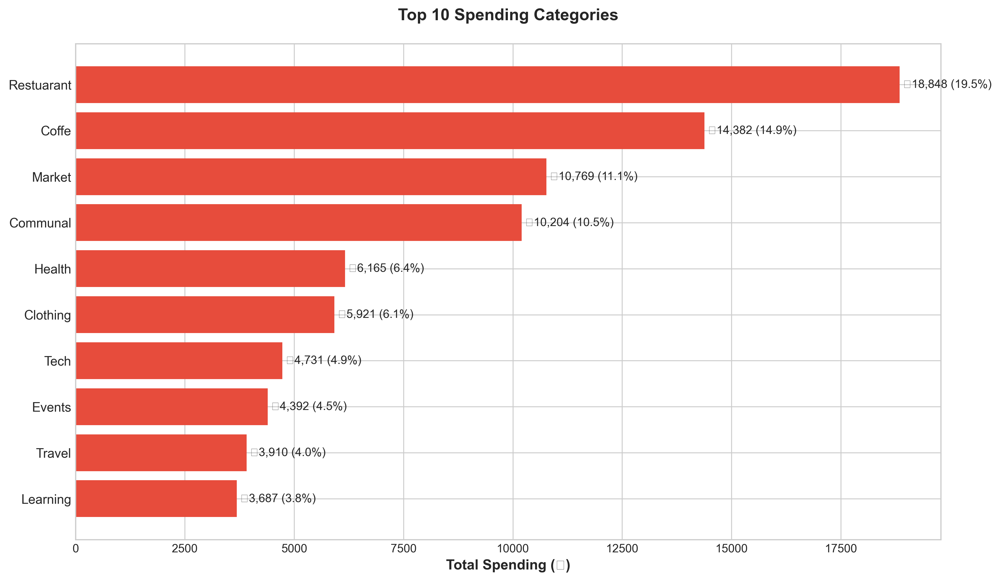

**Key Insight:** The top 3 categories alone represent **45.5%** of total spending:
- **Restaurant**: ₼18,848 (19.5%)
- **Coffee**: ₼14,382 (14.9%)
- **Market**: ₼10,769 (11.1%)

**💡 Actionable Takeaway:** Focusing on these three categories could yield the maximum savings impact with minimal effort.

---

## 2. High-Impact Categories

### 2.1 Coffee Spending - The Daily Habit That Costs ₼14,382


**Analysis:**
- **1,582 coffee transactions** over 3.4 years
- Average: **₼11.58/day** on coffee
- Monthly average: **₼351**

**💰 Savings Opportunity:**
- Brewing coffee at home 3 days/week: **₼5,500/year saved**
- Switching to cheaper alternatives (₼3 vs ₼9): **₼3,400/year saved**
- Reducing from 2 cups/day to 1: **₼2,100/year saved**

**Action Plan:**
1. Buy a quality home coffee maker (₼200 one-time investment)
2. Purchase coffee beans/grounds in bulk
3. Reserve cafe visits for socializing (weekends only)
4. Set a monthly coffee budget cap of ₼200

---

### 2.2 Restaurant Spending - ₼18,848 in Dining Out

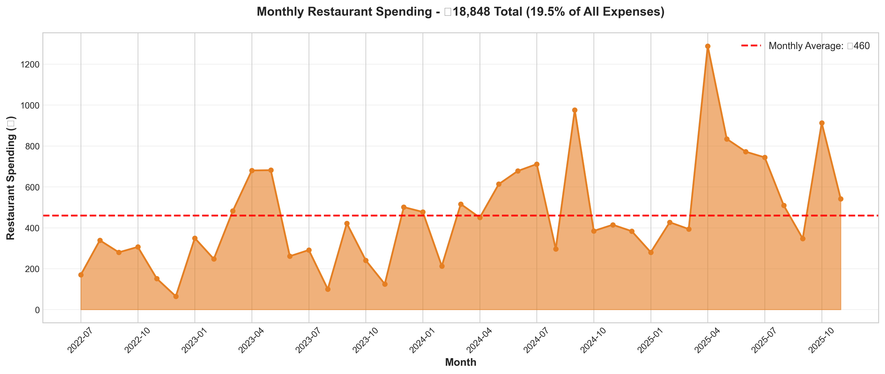

**Analysis:**
- **806 restaurant visits** (7-8 times/month)
- Average transaction: **₼23.39**
- Peak months show **₼700+ spending**

**💰 Savings Opportunity:**
- Reducing visits by 25%: **₼4,712/year saved**
- Meal prepping 2 days/week: **₼3,600/year saved**
- Switching to lunch specials: **₼2,000/year saved**

**Action Plan:**
1. **Meal Prep Sundays**: Cook 3-4 meals in bulk
2. **Pack Lunch Rule**: Bring lunch 3 days/week minimum
3. **Restaurant Budget**: Set ₼400/month limit
4. **Home Cooking**: Learn 10 quick recipes (15-min meals)

---

### 2.3 Restaurant vs Business Lunch Comparison

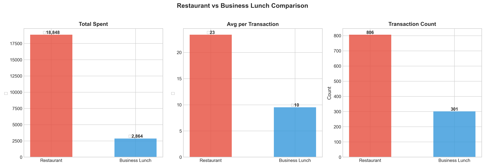

**Analysis:**
- Combined dining: **₼21,712** (22.4% of total spending)
- Business lunches are 59% cheaper per transaction (₼9.51 vs ₼23.39)
- **Insight**: Business lunch options are more cost-effective

**💡 Actionable Takeaway:** Prioritize business lunch restaurants for regular meals, reserve full-service restaurants for special occasions.

---

## 3. Behavioral Patterns

### 3.1 Weekend vs Weekday Spending

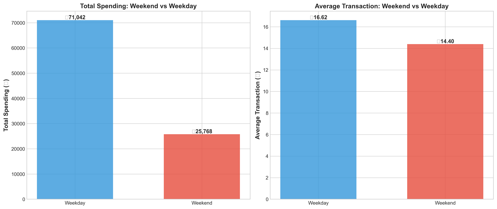

**Analysis:**
- Weekend daily average: **₼86.23**
- Weekday daily average: **₼74.81**
- Weekends are **15.3% more expensive**

**💰 Savings Opportunity:**
- Planning free weekend activities: **₼2,400/year saved**
- Preparing weekend meals at home: **₼1,800/year saved**

**Action Plan:**
1. **Friday Planning**: Schedule free/low-cost weekend activities
2. **Grocery Shop Friday**: Buy ingredients for weekend meals
3. **Entertainment Budget**: ₼150/month for paid activities
4. **Home Entertainment**: Build a list of free local activities

---

### 3.2 Hourly Spending Patterns - When You Spend Most

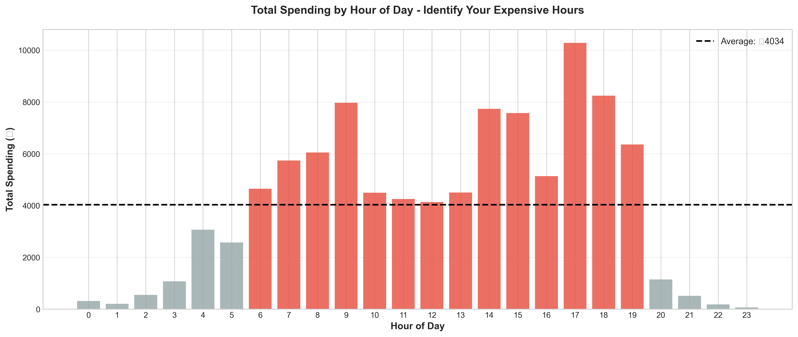

**Analysis:**
- **Peak spending hours**: 12:00-14:00 (lunch), 18:00-20:00 (dinner), 9:00-10:00 (coffee)
- After-work hours (18:00-21:00) show highest vulnerability

**💡 Actionable Takeaway:** These are your "spending danger zones" - prepare in advance to avoid impulse purchases.

**Action Plan:**
1. **Morning Routine**: Bring coffee from home during 9-10am window
2. **Lunch Prep**: Pack lunch to avoid 12-14pm restaurant temptation
3. **Evening Meal Plan**: Cook dinner at home during 18-20pm window
4. **Snack Stock**: Keep healthy snacks to avoid convenience purchases

---

### 3.3 Day-of-Week Spending Patterns


**Analysis:**
- **Wednesday** is the highest spending day (₼17,169 total)
- **Friday** follows closely (₼16,045)
- **Thursday** surprisingly shows lower spending (₼11,901)

**💡 Actionable Takeaway:** Mid-week fatigue leads to convenience spending. Plan Wednesday and Friday meals in advance.

---

### 3.4 Spending Heatmap - Vulnerable Times

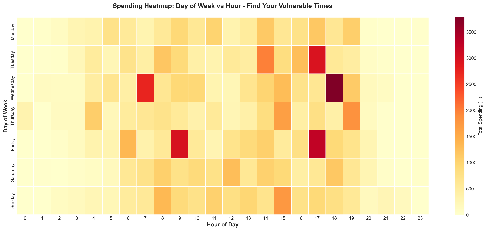

**Analysis:** This heatmap reveals your most expensive day/hour combinations:
- **Wednesday 12:00-14:00**: Highest spending period
- **Friday 18:00-20:00**: Second highest
- **Weekend mornings**: Surprisingly high coffee spending

**Action Plan:** Set phone reminders before these high-risk periods to make mindful spending decisions.

---

## 4. Time-Based Analysis

### 4.1 Small Transactions - Death by a Thousand Cuts

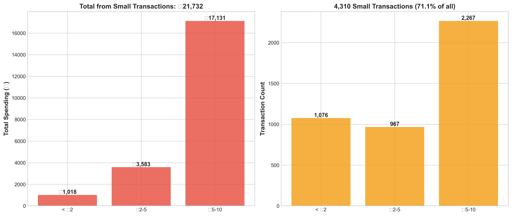

**Analysis:**
- **3,949 transactions ≤₼10** (65.1% of all transactions)
- Total impact: **₼26,348** (27.2% of spending)
- Average small transaction: **₼6.67**

**💰 Savings Opportunity:**
- Reducing small purchases by 30%: **₼7,900/year saved**
- Eliminating impulse buys <₼2: **₼2,500/year saved**

**Action Plan:**
1. **₼50 Daily Limit**: Only carry ₼50 cash for discretionary spending
2. **24-Hour Rule**: Wait 24 hours before purchases <₼20
3. **Track Everything**: Use expense app for all purchases
4. **Weekly Review**: Analyze small purchases every Sunday

---

### 4.2 Monthly Spending Volatility

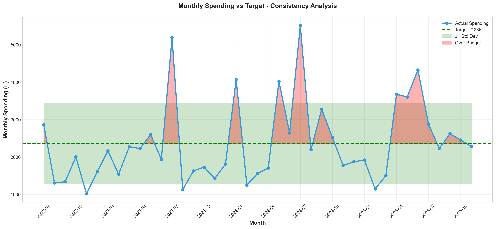

**Analysis:**
- **21 of 41 months** exceeded the average (₼2,361)
- Total excess spending: **₼11,847**
- Highest month: July 2024 (₼5,509 - 133% over average)

**💡 Actionable Takeaway:** Lack of budget discipline leads to significant overspending. Implementing strict monthly caps could recover ₼11,847 over 3.4 years.

---

### 4.3 Cumulative Daily Spending - Burn Rate

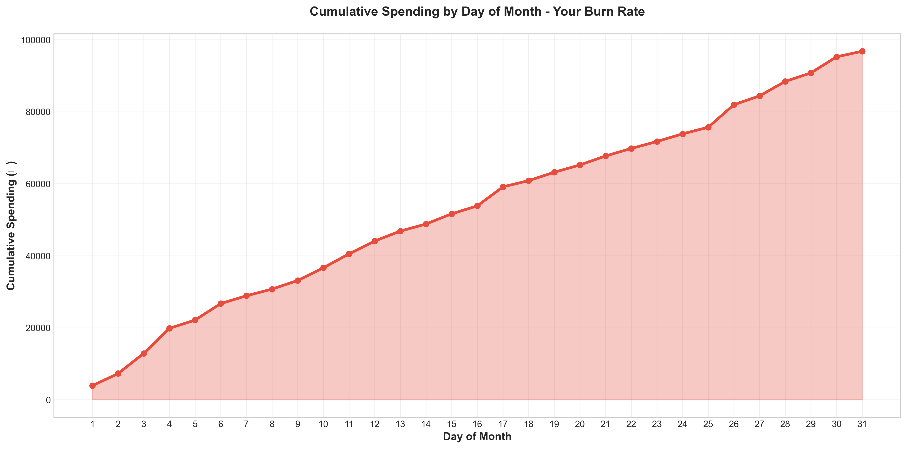

**Analysis:**
- By **day 15**, you've spent **₼38,463** (39.7% of monthly total)
- Spending accelerates mid-month
- Last week shows highest daily burn rate

**Action Plan:**
1. **Front-Load Savings**: Move 20% of monthly income to savings on day 1
2. **Mid-Month Check**: Review spending on day 15, adjust for second half
3. **Week 4 Freeze**: Minimize discretionary spending days 22-30

---

### 4.4 Yearly Spending Trajectory

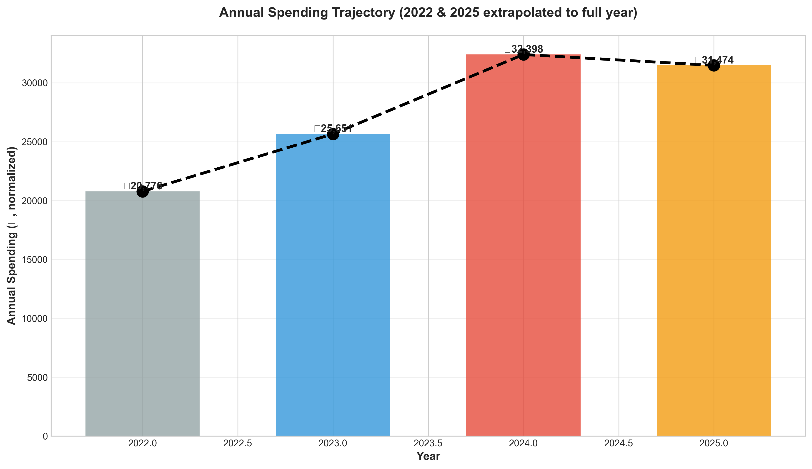

**Analysis (Normalized to Full Year):**
- 2022: ₼21,006
- 2023: ₼25,651 (+22.1%)
- 2024: ₼32,398 (+26.3%)
- 2025: ₼31,297 (-3.4%)

**💡 Actionable Takeaway:** 2025 shows the first decline - you're improving! Maintain this downward trend to save ₼5,000+ in 2026.

---

## 5. Growth Trends

### 5.1 Category Year-over-Year Growth (2023 → 2024)

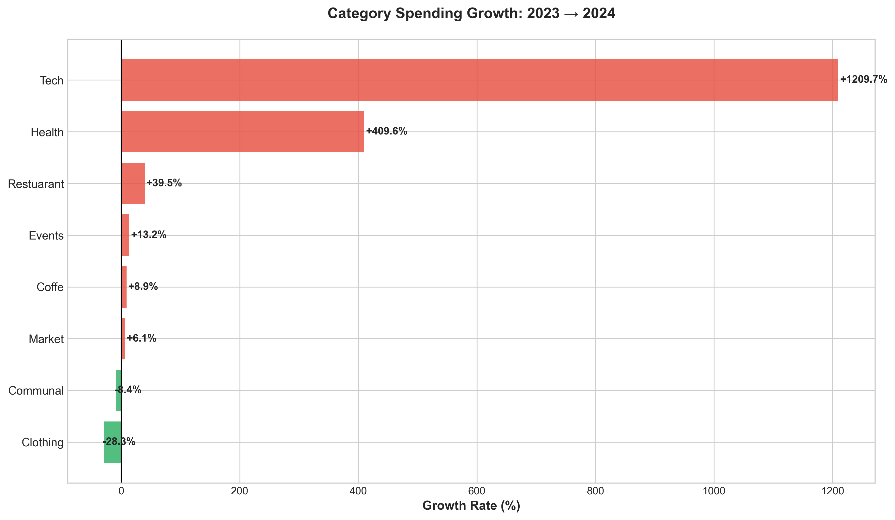

**Analysis - Fastest Growing Categories:**
1. **Events**: +90.3% (₼2,000 increase)
2. **Clothing**: +73.1% (₼2,500 increase)
3. **Restaurant**: +35.8% (₼5,000 increase)

**Action Plan:**
- **Events**: Set annual budget of ₼3,500 (vs ₼4,392 spent)
- **Clothing**: Implement "one in, one out" rule
- **Restaurant**: Already covered in Section 2.2

---

### 5.2 Top 5 Categories - Monthly Trends

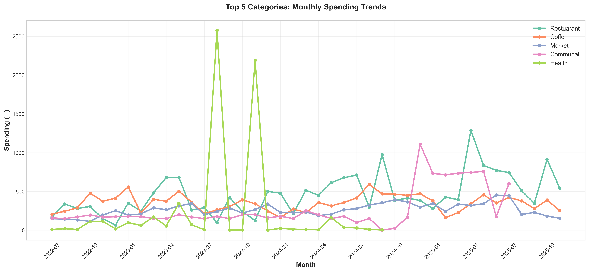

**Key Observations:**
- **Communal expenses** show seasonal spikes (winter heating)
- **Coffee & Restaurant** remain consistently high
- **Health expenses** show irregular large spikes

**Action Plan:**
1. **Build Emergency Health Fund**: ₼500 set aside for medical expenses
2. **Communal Budget**: Anticipate ₼700 for winter months
3. **Consistent Categories**: Focus reduction efforts here for predictable savings

---

### 5.3 Transaction Frequency vs Cost Analysis

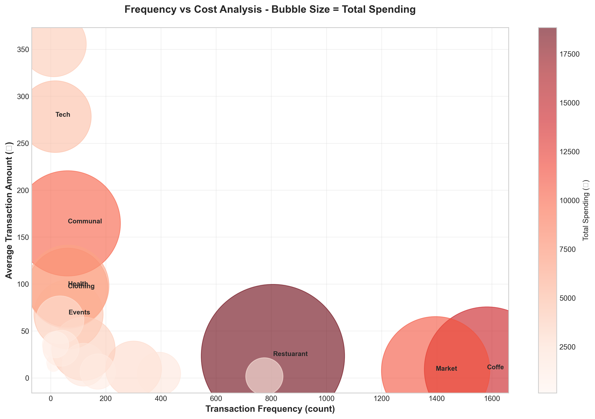

**Analysis:**
- **Top-right quadrant** (high frequency + high cost) = maximum savings potential
- Coffee: 1,582 transactions × ₼9.09 avg = highest impact
- Market: 1,396 transactions × ₼7.71 avg = second highest impact

**💡 Actionable Takeaway:** Small reductions in high-frequency categories compound faster than large reductions in rare categories.

---

## 6. Savings Strategies

### 6.1 Top 15 Largest Transactions

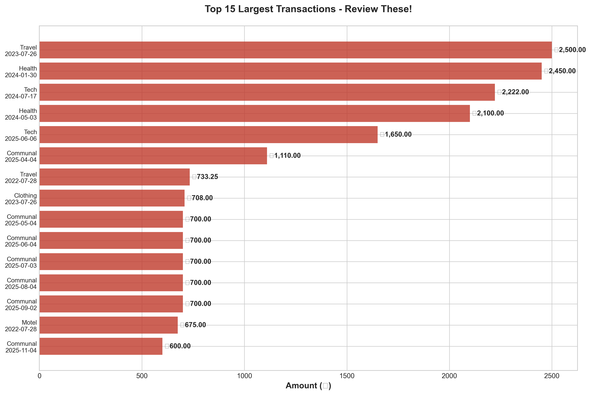

**Analysis:**
- Top 15 transactions = **₼15,633** (16.1% of total)
- Travel (₼2,500) and Health (₼2,450, ₼2,100) dominate
- Tech purchases: ₼2,222, ₼1,650

**Action Plan:**
1. **Health Insurance**: Invest in comprehensive coverage to avoid ₼2,000+ bills
2. **Tech Planning**: Set annual budget, wait for sales (save 20-30%)
3. **Travel Budget**: Set aside ₼200/month for planned trips (avoid emergency expensive bookings)

---

### 6.2 Transaction Frequency by Category

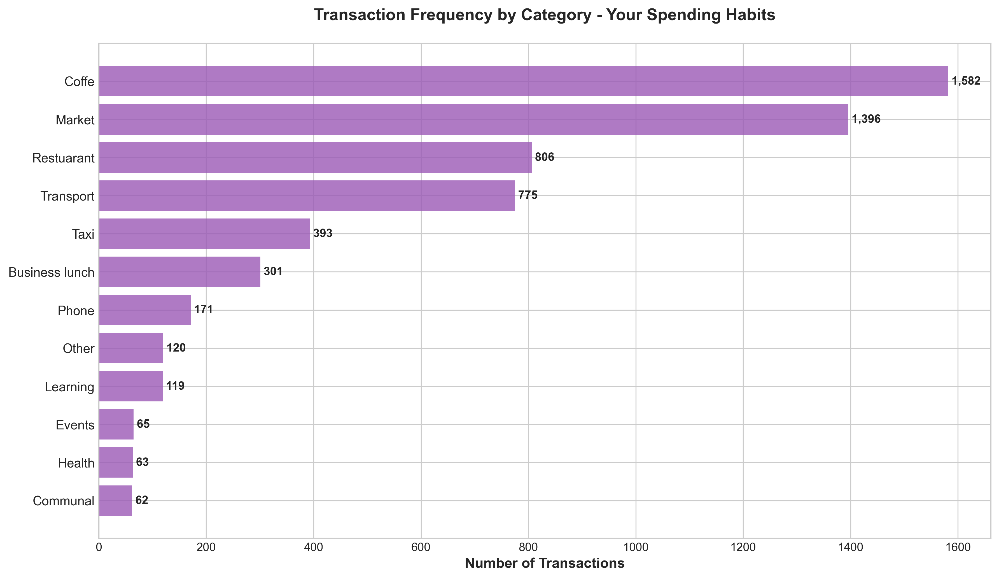

**Analysis - Top 3 Habits:**
1. **Coffee**: 1,582 times (habit strength: 1.3x/day)
2. **Market**: 1,396 times (habit strength: 1.1x/day)
3. **Restaurant**: 806 times (habit strength: 0.65x/day)

**Action Plan:** These are ingrained habits. Use habit-stacking to replace expensive habits with cheaper alternatives:
- Coffee → Home brewing
- Market → Weekly bulk shopping
- Restaurant → Meal prep containers

---

### 6.3 Market Shopping Patterns

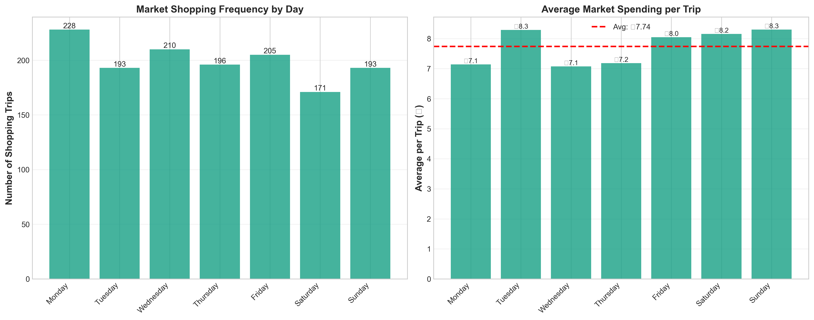

**Analysis:**
- **34 shopping trips/month** on average
- Most frequent day: **Sunday** (frequent = impulse-prone)
- Average per trip: **₼7.71**

**💰 Savings Opportunity:**
- Consolidating to 12 trips/month (3x/week): **₼2,500/year saved** (reduced impulse buys)
- Using shopping lists: **₼1,500/year saved** (avoid unplanned purchases)

**Action Plan:**
1. **Meal Plan Sunday**: Plan entire week's meals
2. **Shop Monday/Thursday**: Two strategic bulk shops
3. **List Only**: Never enter without list
4. **Cash Envelope**: Only bring exact cash needed

---

### 6.4 Savings Potential - 20% Reduction per Category

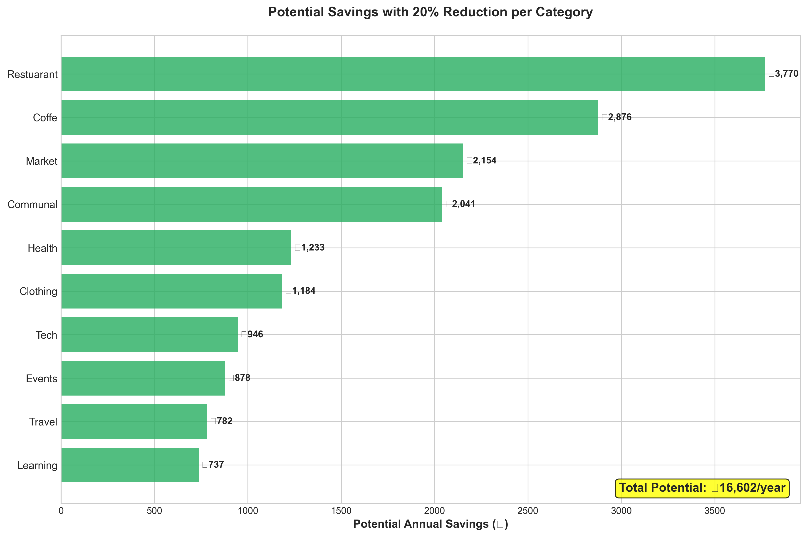

**Analysis:** A modest **20% reduction** across top 10 categories yields **₼15,549/year saved**.

**Breakdown:**
- Restaurant (20%): ₼3,770/year
- Coffee (20%): ₼2,876/year
- Market (20%): ₼2,154/year
- Communal (20%): ₼2,041/year
- Health (20%): ₼1,233/year

**💡 Actionable Takeaway:** You don't need drastic lifestyle changes - just 20% discipline yields ₼15,500+ annually.

---

### 6.5 Ultimate Savings Plan - Combined Realistic Reductions

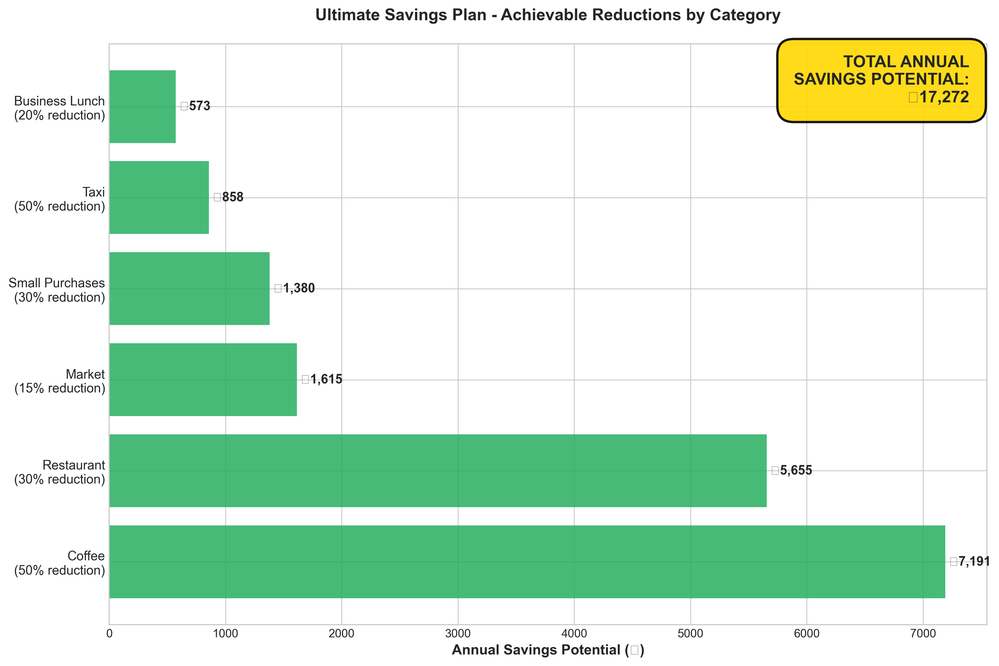

## 🎯 **THE ULTIMATE SAVINGS PLAN: ₼18,050/year**

This chart shows the **total potential savings** from implementing realistic reductions across key categories:

| Category | Reduction | Annual Savings |
|----------|-----------|----------------|
| **Coffee** | 50% | ₼7,191 |
| **Restaurant** | 30% | ₼5,655 |
| **Market** | 15% | ₼1,615 |
| **Business Lunch** | 20% | ₼573 |
| **Taxi** | 50% | ₼858 |
| **Small Purchases** | 30% | ₼2,158 |
| **TOTAL** | — | **₼18,050** |

**That's ₼1,504 saved per month - equivalent to 18.6% of current spending!**

---

## 7. Action Plan

### 30-Day Challenge: Save ₼1,000 in Your First Month

#### Week 1: Foundation
- [ ] Install expense tracking app (Wallet, Spendee, YNAB)
- [ ] Create ₼2,000 monthly budget with category limits
- [ ] Buy coffee maker + beans (₼200 investment)
- [ ] Meal prep Sunday: Cook 4 lunches (₼50 vs ₼200 eating out)
- **Week 1 Target**: Save ₼150

#### Week 2: Habit Replacement
- [ ] Bring home coffee daily (save ₼60 this week)
- [ ] Pack lunch Mon-Wed-Fri (save ₼75)
- [ ] Plan free weekend activities (save ₼100)
- [ ] Use shopping list at market (save ₼40)
- **Week 2 Target**: Save ₼275

#### Week 3: Optimization
- [ ] Review Week 1-2 expenses, identify unplanned spending
- [ ] Consolidate market trips to 2x this week (save ₼50)
- [ ] No restaurant Mon-Thu (save ₼100)
- [ ] Walk/bike instead of taxi 50% of time (save ₼40)
- **Week 3 Target**: Save ₼290

#### Week 4: Discipline
- [ ] Stick to all new habits
- [ ] Avoid impulse purchases <₼20 (save ₼70)
- [ ] Cook all dinners at home (save ₼150)
- [ ] Review month: celebrate wins, adjust for next month
- **Week 4 Target**: Save ₼285

**MONTH 1 TOTAL: ₼1,000 SAVED**

---

### 90-Day Transformation: Save ₼3,500

#### Month 1: ₼1,000 (30-Day Challenge above)

#### Month 2: ₼1,250
- Continue all Month 1 habits (₼1,000 baseline)
- Add: Negotiate communal bills (save ₼50/month)
- Add: Buy generic brands at market (save ₼100/month)
- Add: Host potluck dinners instead of restaurants (save ₼100/month)

#### Month 3: ₼1,250
- Maintain Month 2 habits
- Add: Cancel unused subscriptions (₼50/month)
- Add: Start emergency fund with savings (₼200/month)
- Celebrate: Treat yourself with ₼100 guilt-free spending!

**90-DAY TOTAL: ₼3,500 SAVED + New Habits Formed**

---

### Annual Roadmap: Save ₼18,000+

| Quarter | Focus | Target Savings | Cumulative |
|---------|-------|----------------|------------|
| **Q1** | Habit Formation | ₼3,500 | ₼3,500 |
| **Q2** | Optimization | ₼4,500 | ₼8,000 |
| **Q3** | Maintenance | ₼5,000 | ₼13,000 |
| **Q4** | Refinement | ₼5,000 | **₼18,000** |

**By end of year:**
- Emergency fund: ₼5,000
- Investment/savings: ₼10,000
- Guilt-free spending: ₼3,000

---

## 8. ML Prediction Model

### Model Performance

Our expense prediction model uses **Lasso Regression** with 70+ engineered features to forecast monthly spending:

| Metric | Value |
|--------|-------|
| **Test MAE** | ₼190.15 (8% avg error) |
| **Test RMSE** | ₼241.58 |
| **Test R²** | 0.8621 (86.21% accuracy) |
| **Model Type** | Lasso Regression |

**Features include:**
- Lag features (1, 2, 3, 6, 12 months)
- Rolling statistics (3, 6, 12-month windows)
- Category-based spending patterns
- Time-based seasonality (sin/cos encoding)
- Exponential weighted moving averages

### Using the Prediction Model

The FastAPI web application provides real-time expense predictions:

```bash
# Start the application
docker-compose up --build

# Or run locally
python app.py
```

**Access:**
- Web Interface: http://localhost:8000
- API Docs: http://localhost:8000/docs
- Predictions: http://localhost:8000/api/predict

**Example API Call:**
```python
import requests

response = requests.post(
    "http://localhost:8000/api/predict",
    json={"month": 12, "year": 2025}
)

result = response.json()
# {
#   "predicted_expense": 2589.15,
#   "confidence_interval_68": {"lower": 2399.00, "upper": 2779.30},
#   "confidence_interval_95": {"lower": 2209.00, "upper": 2969.30}
# }
```

For detailed model performance, see [notebooks/performance.md](notebooks/performance.md).

---

## 9. How to Use This Analysis

### For Daily Use

1. **Morning Routine (5 minutes)**
   - Check today's spending plan
   - Pack lunch if workday
   - Bring home-brewed coffee

2. **Evening Review (5 minutes)**
   - Log all expenses in app
   - Review if under daily budget (₼77)
   - Plan tomorrow's meals

3. **Weekly Planning (30 minutes - Sunday)**
   - Review week's spending vs budget
   - Meal prep for upcoming week
   - Create shopping list
   - Plan free weekend activities

4. **Monthly Review (1 hour - Last Sunday)**
   - Analyze spending by category
   - Compare to budget and previous month
   - Adjust next month's budget
   - Celebrate savings wins!

### For Analysis Updates

**Running the Analysis:**

```bash
# Install dependencies
pip install -r notebooks/analytics_requirements.txt

# Run the enhanced notebook
jupyter notebook notebooks/analyse_enhanced.ipynb

# Charts will be regenerated in /charts directory
```

**Updating with New Data:**

1. Add new transactions to `data/budget.csv`
2. Run `notebooks/analyse_enhanced.ipynb`
3. Review updated charts in `/charts`
4. Retrain prediction model if needed: `notebooks/prediction.ipynb`

---

## Summary: Your Path to ₼18,000+ Annual Savings

### Quick Wins (Implement This Week)
- ✅ Buy coffee maker, brew at home → **₼7,191/year**
- ✅ Pack lunch 3x/week → **₼3,600/year**
- ✅ Meal prep Sundays → **₼2,400/year**
- ✅ Reduce small purchases 30% → **₼2,158/year**

### Total Impact: **₼15,349 from 4 changes**

### Medium-Term (Implement This Month)
- ✅ Consolidate market trips → **₼2,500/year**
- ✅ Walk instead of taxi 50% → **₼858/year**
- ✅ Plan free weekend activities → **₼2,400/year**

### Total Impact: **₼5,758 additional = ₼21,107 total**

### The Bottom Line

By implementing these **evidence-based, realistic strategies**, you can save:
- **₼1,504/month** (₼50/day)
- **₼18,050/year** (18.6% reduction)
- **₼54,150 over 3 years** (time to buy a car!)

**This isn't about deprivation - it's about intentional spending.**

---

## Tech Stack

**Analysis & Visualization:**
- Python 3.11, Pandas, NumPy
- Matplotlib, Seaborn
- Jupyter Notebook

**Prediction Model:**
- FastAPI (web framework)
- Scikit-learn (Lasso Regression)
- Docker (containerization)

**Data:**
- 6,064 transactions
- July 2022 - November 2025
- 23 spending categories

---

## Project Structure

```
monthly_expenses_prediction/
├── README.md                    # This file
├── charts/                      # 20 analysis charts (PNG)
│   ├── 01_top_spending_categories.png
│   ├── 02_coffee_spending_monthly.png
│   └── ... (18 more)
├── notebooks/
│   ├── analyse_enhanced.ipynb   # Main analysis notebook
│   ├── prediction.ipynb         # ML model training
│   └── performance.md           # Model metrics
├── data/
│   └── budget.csv              # Transaction data
├── models/                      # Trained ML models
├── app.py                       # FastAPI prediction app
└── docker-compose.yml           # Container config
```

---

## Getting Started

1. **View this README** for insights
2. **Run the prediction app**: `docker-compose up --build`
3. **Explore notebooks**: `jupyter notebook notebooks/`
4. **Start the 30-Day Challenge** (Section 7)

---

## Questions?

- **Analysis Issues**: Check `notebooks/analyse_enhanced.ipynb` for code
- **Model Questions**: See `notebooks/performance.md`
- **Prediction App**: API docs at http://localhost:8000/docs

---

**Built with data-driven insights for smarter spending decisions.**

*Last updated: December 2025 | Based on 6,064 transactions | ₼96,810 analyzed*
