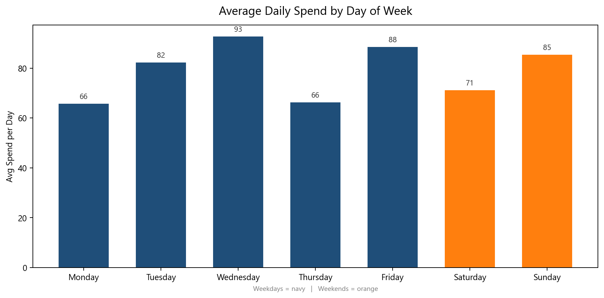
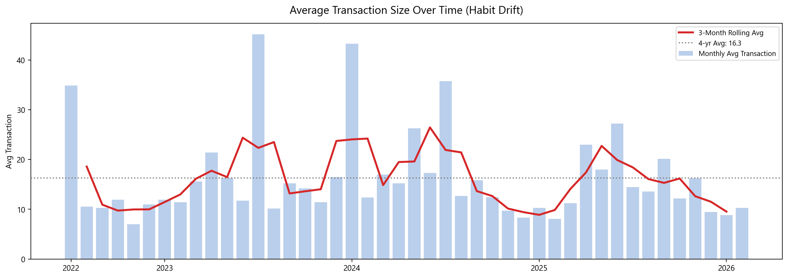
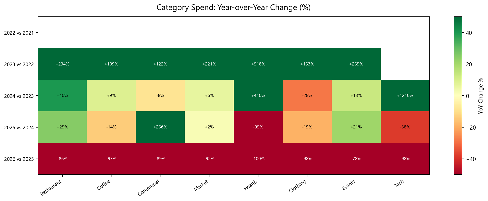

**Spending Snapshot (Jul 2022–Feb 2026)**
Over 44 months I spent 102,321 AZN across 6,606 transactions in 23 categories. This document distills that data into the decisions that actually move the total — not micro-optimizations, but the few levers that shape the budget path.

**Key Findings**
- Three categories (Restaurant, Coffee, Market) account for nearly half of all transactions but under 45% of total spend — high frequency, moderate damage.
- The biggest budget swings come from a handful of large one-off transactions, not daily habits.
- Weekends consistently cost more per day than weekdays — leisure spending is the invisible leak.
- Annual spend grew year-over-year; the trajectory is upward and requires active control.
- Average transaction size drifts slowly upward — habits are getting more expensive without feeling like it.
- Category YoY patterns reveal which buckets are accelerating and which are stable.

---

**1) Category Concentration: The Largest Levers**

What the charts show: Total spend ranked by category, with an average reference line. The concentration chart shows how quickly the top categories dominate the total, including exact amounts and percentage share.

Why this matters: Categories above the average line are the high-impact levers. Everything below it is noise relative to the total.

How this guides decisions:
- Caps and controls target only the categories above average — those are the only ones large enough to matter.
- The "Other" bucket in the concentration chart is deliberately small; spreading attention to it wastes focus.

---

**2) Spend Trend: Direction and Volatility**

What the chart shows: Monthly totals with a 3-month rolling average and the 4-year baseline. The rolling average cuts through noise and shows the real direction. The peak month is annotated directly on the chart.

Why this matters: Monthly volatility is driven by one-off spikes, not by steady drift. The rolling average makes the underlying trend visible — and that trend matters more than any single month.

How this guides decisions:
- When the rolling average rises above the baseline, that signals a structural shift worth investigating.
- Monthly spikes above the rolling average are reviewed to identify whether they represent a planned event or a surprise.

---

**3) Quarterly Category Breakdown: Composition Over Time**

What the chart shows: Quarterly spend stacked by the top 5 categories. Quarterly aggregation removes monthly noise and reveals seasonal shifts in the composition of spend.

Why this matters: The mix of categories within each quarter shows whether the total is rising because of a specific category (controllable) or broadly across all categories (structural).

How this guides decisions:
- Quarters where one category visibly expands its share are investigated first.
- Seasonal patterns inform when to tighten specific categories before they typically spike.

---

**4) Cumulative Pace: How the Budget Path Was Set**

What the chart shows: The cumulative spend curve from day one to the present, with milestone markers at 25k AZN, 50k AZN, 75k AZN, and 100k AZN. The shaded area shows total committed spend at any point in time.

Why this matters: The slope of this curve is determined early. Large early-period expenses lock in the trajectory and compress the room to maneuver later.

How this guides decisions:
- Large planned expenses are scheduled to avoid clustering in the same quarter.
- The 100k AZN milestone was crossed before February 2026 — awareness of the pace informs what the next 12 months should look like.

---

**5) Annual Growth: The Year-over-Year View**

What the chart shows: Annual totals for each full year, with year-over-year growth percentage displayed inside each bar. The current partial year is highlighted in orange.

Why this matters: YoY growth is the clearest signal of whether spending is under control. A growing total year after year without a corresponding income increase is a structural problem.

How this guides decisions:
- The target for the next full year is set against the prior year's total, not against a budget built from scratch.
- YoY growth above 10% triggers a category-level review to identify the source.

---

**6) Frequency vs. Value: Where Habits Help — and Hurt**

What the chart shows: Total spend (bars) versus transaction count (line) per category, with average transaction size embedded inside each bar. This separates high-frequency habits from high-value decisions.

Why this matters: Some categories look small because each transaction is cheap — but the frequency compounds. Others look large because each transaction is expensive. The embedded average per transaction is the key number.

How this guides decisions:
- High average transaction + low frequency = planned event category. Control the decision, not the habit.
- Low average transaction + high frequency = habit category. Control the drift, not individual transactions.

---

**7) Largest Transactions: Fast Wins**

What the chart shows: The ten largest individual transactions across 44 months, with date and category for each.

Why this matters: These ten transactions alone represent a significant share of total spend. Reviewing them takes minutes and yields the highest return on attention.

How this guides decisions:
- Any single transaction above a threshold is reviewed before it posts, not after.
- Large transactions in discretionary categories (not utilities) are treated as decisions that need justification, not defaults.

---

**8) Weekend Effect: The Invisible Leak**

What the chart shows: Average spend per calendar day broken down by day of week. Weekends are highlighted in orange. This reveals whether leisure behavior is adding a consistent premium to the weekly total.

Why this matters: Weekend spending is mostly discretionary — it is the easiest category to adjust without affecting quality of life during the workweek.

How this guides decisions:
- Weekend days with consistently higher spend are treated as the primary target for behavioral adjustment.
- A simple weekend budget cap can reduce annual spend without touching any weekday category.

---

**9) Habit Drift: Are Transactions Getting More Expensive?**

What the chart shows: The average transaction size per month with a 3-month rolling average and the 4-year baseline. Rising average transaction size is the signature of habits becoming more expensive without frequency changing.

Why this matters: Inflation, lifestyle creep, and category substitution all show up first in average transaction size — before they become visible in total spend.

How this guides decisions:
- When the rolling average rises above the 4-year baseline, it signals that something in the everyday spending mix is getting more expensive.
- This is the early warning system. Acting on it before the total rises is the most efficient form of budget control.

---

**10) Category Growth Map: What Is Accelerating**

What the chart shows: A heatmap of year-over-year percentage change for the top 8 categories. Green = spending fell relative to prior year. Red = spending rose. The intensity shows magnitude.

Why this matters: Not all growth is equal. A category that grows 40% year-over-year requires immediate attention. A category flat or declining is already under control.

How this guides decisions:
- The reddest cells identify where to look first when planning the next annual review.
- Consistently green categories are left alone — they are working.
- Any category moving from green to red year-over-year signals a behavioral shift, not just a bad month.

---

**Saving Strategy Summary**
- The first savings wins come from the top categories by total spend — not from the long tail.
- Annual YoY growth is the primary health signal; categories growing faster than total spend need caps.
- Weekend spending is the highest-leverage behavioral adjustment with the lowest friction.
- Habit drift (rising avg transaction size) is the early warning system before total spend accelerates.
- Large one-off transactions define peak months; reviewing them before they post is more effective than reviewing after.
- The YoY category heatmap identifies exactly which buckets to prioritize each year.

All charts are generated from the same dataset and directly support the decisions above.
